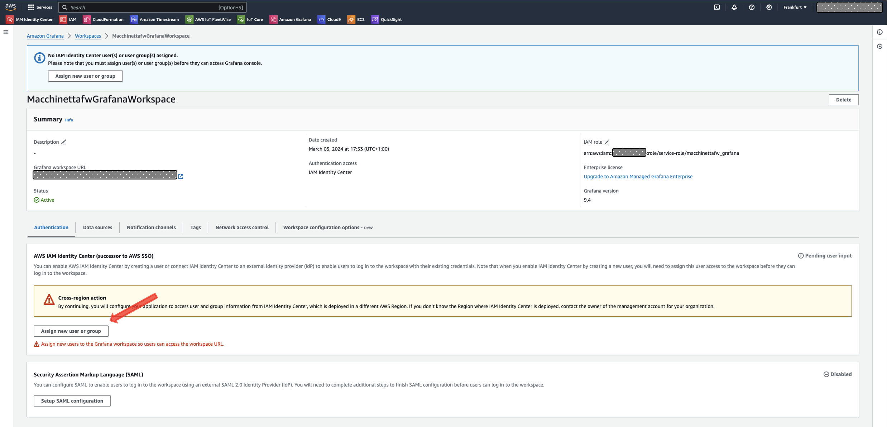
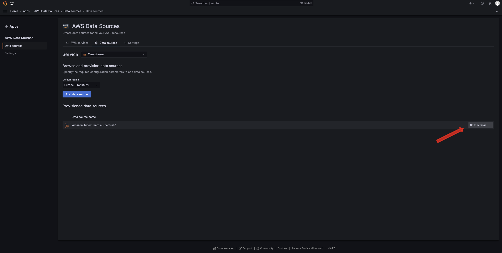
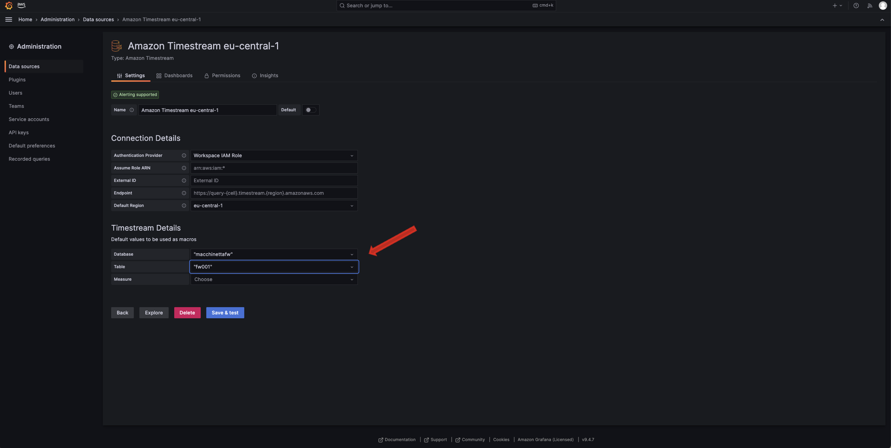
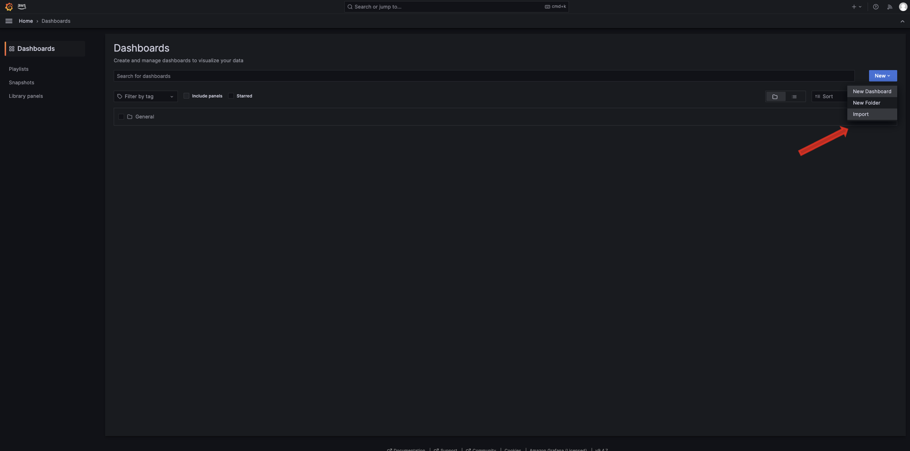
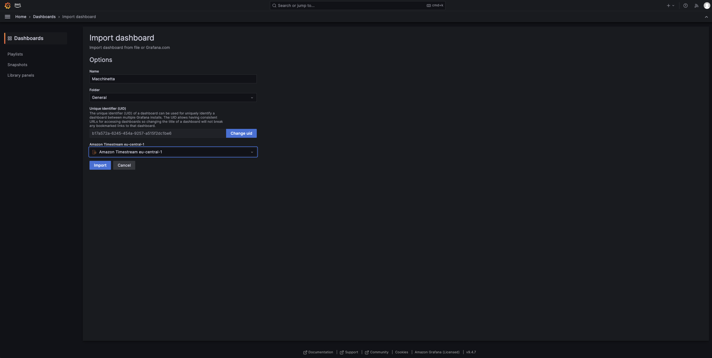
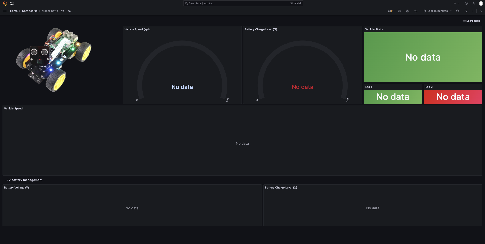

This file contains detailed information for installing and configuring the Macchinetta prototype.

## Prerequisites

The demo has been built using Python 3.10 for compatibility with different components. We suggest to use this version to test the solution. All the file and library were built and tested using this Python 3.10.

Note: to use Amazon Managed Grafana, you must have configured AWS IAM Identity Center and create a user. You can refer to the [documentation](https://docs.aws.amazon.com/singlesignon/latest/userguide/what-is.html).

## On the cloud:

### 0. Roles and Policies

First of all, create the TimestreamExecutionRole that will be used by AWS IoT Fleetwise campaign to access to Amazon Timestream table.

To create these resources with the aws-cli run the following command using the json files in the [infra](../cloud/infra/) folder from this [repo](https://gitlab.aws.dev/iot1/macchinetta):

```
cd cloud/infra/
#Edit trust-policy.json and permissions-policy.json with your account info
aws iam create-role --role-name TimestreamExecutionRole --assume-role-policy-document file://trust-policy.json

aws iam create-policy --policy-name AWSIoTFleetwiseAccessTimestreamPermissionsPolicy --policy-document file://permissions-policy.json
```

```
aws iam attach-role-policy --policy-arn <permissions-policy-arn> --role-name TimestreamExecutionRole
```

(Refer to the [Grant AWS IoT FleetWise access to a Amazon Timestream destination](https://docs.aws.amazon.com/iot-fleetwise/latest/developerguide/controlling-access.html#using-timestream))

### 1. Cloudformation

In this section, we use AWS CloudFormation Templates to create two necessary AWS resources: Amazon Timestream and Amazon Managed Grafana. You can download the CloudFormation Templates from the cloud/infra folder from this [repo](https://gitlab.aws.dev/iot1/macchinetta) and follow the steps below.

Notes:

1. In the following steps we show the use of aws-cli to create the stack using CF Templates. If you prefer, you can use the AWS CloudFormation console instead of aws-cli using the same CF Templates.
2. The commands shown use the AWS Region eu-central-1, but you can easily modify them and use any region that has IoT and Timestream services

#### Step 1: Create Amazon Managed Grafana and Amazon S3 Bucket (AWS CLI)

In this step, you will create one instance of Amazon Managed Grafana and one Amazon S3 bucket that will be used in step 2 by Amazon Timestream to write error reports for rejected records when writing to Magnetic Store. To create these resources with the aws-cli run the following command:

```
cd cloud/infra/
```

```
aws cloudformation create-stack \
--stack-name MacchinettaFW-Grafana-S3 \
--template-body file://01-Grafana-S3-fw.yml \
--capabilities CAPABILITY_NAMED_IAM \
--region eu-central-1
```

The previous command immediately outputs only the StackID and in about 5 minutes, you will have these new resources:

1. An Amazon Managed Grafana workspace
2. An Amazon S3 bucket named “macchinetta-<account_id>-<AWSRegion>”
3. A IAM Role (used by Grafana)

You can check the creation status using this command:

```
aws cloudformation describe-stacks \
--stack-name MacchinettaFW-Grafana-S3 \
--query "Stacks[0].StackStatus" \
--region eu-central-1
```

When the creation status is "CREATE_COMPLETE", write down the Grafana URL to access the Grafana Dashboard using this command (or by viewing the Outputs tab in the CloudFormation Console):

```
aws cloudformation describe-stacks \
--stack-name MacchinettaFW-Grafana-S3 \
--query "Stacks[0].Outputs[3]" \
--region eu-central-1
```

#### Step 2: Create Amazon Timestream database and table (AWS CLI)

Choosing to use a different CF Template for creating the Amazon Timestream database and table allows for greater flexibility in deleting data without eliminating the entire stack that would take longer.
To create these two resources with the aws-cli run the following command:

```
aws cloudformation create-stack \
--stack-name MacchinettaFW-TimeStream \
--template-body file://02-timestream-macchinetta-fw.yml \
--region eu-central-1
```

You can check the creation status using this command:

```
aws cloudformation describe-stacks \
--stack-name MacchinettaFW-TimeStream  \
--query "Stacks[0].StackStatus" \
--region eu-central-1
```

Now you have a database and a table respectively named ‘macchinettafw’ and ‘fw001’.

### 2. AWS IoT FleetWise

To model vehicles you will use Signals (contains vehicle data and its metadata), Signal Catalog (contains a collection of signals), Vehicle model (structures to standardize the format of the vehicles and define relationships between signals) and decoder manifests (contain decoding information for each signal in vehicle model).

```
cd cloud/Fleetwise/
```

#### 2.a Create signal catalog

```
aws iotfleetwise create-signal-catalog --cli-input-json file://signals.json
```

#### 2.b Create vehicle model

Replace the ARN of the catalog you create in the previous step in the model.json file

```
aws iotfleetwise create-model-manifest --cli-input-json file://model.json
```

Activate the model

```
aws iotfleetwise update-model-manifest --name [nameofthemodel]--status ACTIVE
```

#### 2.c Create decoder manifest

Replace the ARN of the model you create in the previous step in the decoder.json file

```
aws iotfleetwise create-decoder-manifest --cli-input-json file://decoder.json
```

Activate the decoder manifest

```
aws iotfleetwise update-decoder-manifest --name [name of the decoder] --status ACTIVE
```

#### 2.d Create the Vehicle

Create a vehicle on AWS IoT Fleetwise as described in the [documentation](https://docs.aws.amazon.com/iot-fleetwise/latest/developerguide/create-vehicle-console.html)

#### 2.e Create and deploy campaigns

Create a Data Collection Campaign that collects data as described in the blog post.

### 3. AWS IoT Core and Amazon Location Service

You are using a GPS simulator. Simply set the start position and end position and the simulator will send a point every 10 seconds. The point is displayed on the map on the controller.
You need to create a route calculator on Amazon Location Service and an associated API key.

```
aws location create-route-calculator --calculator-name <name of your key> \
--data-source <Esri | Here | Grab>
aws location create-key --key-name <name of your key> --restrictions '{"AllowActions":["geo:CalculateRoute"],"AllowResources":["<ARN of the route>"]}'

```

Write the API key and calculator name in the config.json

### 4. Main Dashboard

### 5. Detailed data visualization

At step 1 of the first paragraph, you created an Amazon Managed Grafana workspace through a CF Template. In this section, you will use some manual steps to import and configure the Grafana dashboard. You can download the dashboard-fw.json file from the cloud/infra folder from this [repo](https://gitlab.aws.dev/iot1/macchinetta).
After imported, the Grafana dashboard will read the data from the Timestream table, which you already created in step 2 of the first paragraph. This table is continuously populated by Iot FleetWise.

Follow these steps below to import a sample dashboard and configure the users, the Timestream plug-in, and the data source:

1. Give a user access to the Amazon Managed Grafana workspace as Admin, by following steps 1 to 6 in this [guide](https://docs.aws.amazon.com/grafana/latest/userguide/AMG-manage-users-and-groups-AMG.html)

{width=80%}

2. Install the Timestream plugin using this [guide](https://docs.aws.amazon.com/grafana/latest/userguide/grafana-plugins.html) and the Grafana console URL that you wrote down in Step 1
3. Close and reopen the Grafana workspace and configure the Timestream data source using this [guide](https://docs.aws.amazon.com/grafana/latest/userguide/Timestream-adding-AWS-config.html) starting from step 7 (in step 10 select the AWS Region in which you created all the resources)
4. On the bottom-right of the screen, on the same line of the Amazon Timestream datasource, click on “Go to Settings”. In the new screen in the Timestream Details section choose Database: ‘macchinettafw’ and Table: fw001. Click on “Save & test”. You can refer to the following two screenshots:

{width=80%}
{width=80%}

5. To import the Grafana dashboard follow these steps:

5a. Click Dashboards in the left-side menu.

5b. Click New and select Import in the dropdown menu.

{width=80%}

5c. Upload the dashboard-fw.json file you downloaded from the cloud/infra folder from the [repo](https://gitlab.aws.dev/iot1/macchinetta).

5d. Select the Amazon Timestream datasource and click on Import.

{width=80%}

You will see the imported dashboard. Note that if the Timestream table is empty, the dashboard may give some display errors (they will disappear when you start entering the data)

{width=80%}

## On the vehicle

### 6. Server

#### 6.a Setup the virtual CAN interface

Create virtual can device

```
sudo modprobe vcan
sudo ip link add dev vcan0 type vcan
sudo ip link set up vcan0
```

You can verify if virtual CAN interface is set up with:

```
ip link show
```

To load module also at startup copy vcan-start folder from the repo to your home folder and then give the following commands:

```
sudo cp ~/vcan-start/setup-socketcan.service /lib/systemd/system/setup-socketcan.service
sudo cp ~/vcan-start/setup-socketcan.sh /usr/local/bin/setup-socketcan.sh
sudo systemctl enable setup-socketcan
sudo systemctl start setup-socketcan
```

Install the package:

```
sudo apt install -y can-utils

```

#### 6.b Compile and install the agent

You will need to compile it on a development machine (ARM-64 architecture with Ubuntu 20.04) and then copy the binaries to the Raspberry Pi. Or you can use the precompiled binary in the Raspberry folder.

If you decide to compile the agent yourself, please follow the instructions listed [here](https://github.com/aws/aws-iot-fleetwise-edge/blob/main/docs/rpi-tutorial/raspberry-pi-tutorial.md) from step2 to step 3.

Provision the credentials of the IoT Thing (the vehicle) by running the following command:
(please modify vehicle-name e region)

```
../tools/provision.sh \
   --vehicle-name <name> \
   --certificate-pem-outfile certificate.pem \
   --private-key-outfile private-key.key \
   --endpoint-url-outfile endpoint.txt \
   --vehicle-name-outfile vehicle-name.txt \
   --region <region>

../tools/configure-fwe.sh \
   --input-config-file ~/aws-iot-fleetwise-edge/configuration/static-config.json \
   --output-config-file config-0.json \
   --log-color Yes \
   --vehicle-name `cat vehicle-name.txt` \
   --endpoint-url `cat endpoint.txt` \
   --can-bus0 vcan0
```

Your agent is now ready to be copied to the Raspberry Pi, download it from the development machine to your local machine:

```
scp -i <PATH_TO_PEM> ubuntu@<EC2_IP_ADDRESS>:aws-iot-fleetwise-deploy/aws-iot-fleetwise-deploy.zip .
```

From your development machine copy it to the Raspberry Pi

```
scp aws-iot-fleetwise-deploy.zip ubuntu@ubuntu:
```

If you don't want to compile the agent, you can copy the agent provided in the Agent folder and copy it into the the Raspberry Pi as described above.

One done give the following commands to install the agent:

```
mkdir -p ~/aws-iot-fleetwise-deploy && cd ~/aws-iot-fleetwise-deploy \
&& unzip -o ~/aws-iot-fleetwise-deploy.zip \
&& sudo mkdir -p /etc/aws-iot-fleetwise

# Copy Certificate and Private key in config folder

CAR_NAME=you_car_name
API_ENDPOINT=your_api_endpoint
sed -i "s/<CAR_NAME>/$CAR_NAME/g" config/config-0.json
sed -i "s/<API_ENDPOINT>/$API_ENDPOINT/g" config/config-0.json


sudo cp config/* /etc/aws-iot-fleetwise
```

Copy the certificates you downloaded when creating the vehicle into the **/etc/aws-iot-fleetwise** folder on the Raspberry PI renaming the private key to private-key.key and the certificate as certificate.pem deleting the old ones.
Change the car name in vehicle-name.txt and the endpoint in endpoint.txt if needed (you can find it in 'settings' in AWS IoT Core console).
Modify the file /etc/aws-iot-fleetwise/config-0.json:

1. using the correct information for endpointUrl and clientId variables (the last is equal to vehicle name)
2. substituting the string 'fwdemo-rpi' with the vehicle name inside the definition of the following four variables: "collectionSchemeListTopic", "decoderManifestTopic", "canDataTopic" and "checkinTopic"

Install the agent:

```
sudo ~/aws-iot-fleetwise-deploy/tools/install-fwe.sh
```

To verify your Edge Agent is running and is connected to the cloud, check the log file:

```

sudo journalctl -fu fwe@0 --output=cat

```

If everything works you should see:

```
$ Started FWE #0.
$ [Thread: 1384] [2024-03-03T10:55:47.371Z] [INFO ] [IoTFleetWiseEngine.cpp:833] [connect()]: [Engine Connected]

```

To stop/start/restart the agent:

```
sudo systemctl stop/start/restart fwe@0
```

#### 6.c Install the server

The server is installed on a Raspberry Pi, where Python (version 3.xx), the Flask web server and other packages need to be installed.

Install pip:

```
sudo apt install python-pip
```

Copy the Raspberry/Server folder to the Raspberry Pi, and then use this command to install the requirements:

```
sudo pip install -r requirements.txt
```

!!!!!RIMUOVERE LA CHIAVE PUBBLICA DAL CONFIG.JSON
Create a folder named certs into Raspberry/Server folder.
Copy the certificates you downloaded before into Raspberry/Server/certs folder.
You also need to copy the AmazonRootCA1.pem in the same directory.
Modify the **Raspberry/Server/config.json** file, with the correct endpoint and vehiclename.

(\*) Other variables like routecalculator, apikey will be modified later.

Make sure everything is correct.

#### 6.d Configure Camera

Enable the camera by appending the following configuration to /boot/firmware/config.txt:

```
start_x=1
gpu_mem=128
```

Install the OpenCV library with GStream Enabled (This is no enabled in the pip package opencv-python)
Upload the library "opencv_python-4.9.0.80-cp38-cp38-linux_aarch64.whl" from the [Lib](../Lib/) folder.

```
sudo pip install opencv_python-4.9.0.80-cp38-cp38-linux_aarch64.whl
```

This Library has been complied on Linuc AArch 64 using Python 3.8. If you are using a different Python version or CPU architecture you should recompile the library for your use-case.

```
sudo apt-get install libgstreamer1.0-dev libgstreamer-plugins-base1.0-dev libgstreamer-plugins-bad1.0-dev gstreamer1.0-plugins-base gstreamer1.0-plugins-good gstreamer1.0-plugins-bad gstreamer1.0-plugins-ugly gstreamer1.0-libav gstreamer1.0-tools gstreamer1.0-x gstreamer1.0-alsa gstreamer1.0-gl gstreamer1.0-gtk3 gstreamer1.0-qt5 gstreamer1.0-pulseaudio
```

#### 6.e Add kvssink

Manually build kvssink (For more details, refer to https://github.com/awslabs/amazon-kinesis-video-streams-producer-sdk-cpp)-

```
git clone https://github.com/awslabs/amazon-kinesis-video-streams-producer-sdk-cpp.git
mkdir -p amazon-kinesis-video-streams-producer-sdk-cpp/build
cd amazon-kinesis-video-streams-producer-sdk-cpp/build
sudo apt-get install libssl-dev libcurl4-openssl-dev liblog4cplus-dev libgstreamer1.0-dev libgstreamer-plugins-base1.0-dev gstreamer1.0-plugins-base-apps gstreamer1.0-plugins-bad gstreamer1.0-plugins-good gstreamer1.0-plugins-ugly gstreamer1.0-tools
cmake -DBUILD_GSTREAMER_PLUGIN=TRUE -DBUILD_DEPENDENCIE=FALSE ..
make
sudo make install
cp ~/amazon-kinesis-video-streams-producer-sdk-cpp/build/libgstkvssink.so ~/Server/lib
```

To set Log Level, create a file [kvs_log_configuration](https://github.com/awslabs/amazon-kinesis-video-streams-producer-sdk-cpp/blob/master/kvs_log_configuration) in the Server parent folder

Configure the certificate permission to Assume Role
https://docs.aws.amazon.com/kinesisvideostreams/latest/dg/how-iot.html

### 7. Controller

#### 7.a Web interface

To build the controller, download all the files from the Controller folder in your local machine then build them with the commands:

```
cd <folder where you downloaded the files>/Controller
npm install
npm run build
```

From the Controller/dist folder (in the local machine) copy:

1. index.html into Server/templates folder into the RaspberryPi

2. bundle.js into Server/static folder into the RaspberryPi

#### 7.b Bluetooth controller

You can also pair your bluetooth controller to the car.

##### Install

```
#install Required Libraries
sudo apt-get install bluez bluez-tools bluetooth pi-bluetooth

#Reboot the Raspberry
sudo reboot now

#Start Bluetooth Scan

sudo bluetoothctl
scan on

#Turn on Device And see  MAC address
trust MAC_ADDRESS
pair MAC_ADDRESS
connect MAC_ADDRESS
```

##### Run

You need to start the joystick controller in another shell with the following command:

```
python Joystick.py
```

The joystick communicates with the server via websocket using the same event as the web controller.
You can choose which controller to use, PS or Xbox, in config.json

## Test

Start the server from Raspberry/Server directory:

```
sudo python app.py
```

Point your browser to ip:port of you Raspberry Pi and have fun!

## Cleaning Up

DA TESTARE

cd ~/aws-iot-fleetwise-edge/tools/cloud \
&& ./clean-up.sh \
&& ../provision.sh \
 --vehicle-name <the name of your vehicle> \
 --region <region> \
 --only-clean-up

```

```

To decommission all the resources deployed during this walkthrough, use the following steps:

**INSERIRE LE ALTRE PARTI DI CUI FARE CLEANUP**

- Delete the Timestream stack by running the following command:

```
aws cloudformation delete-stack \
--stack-name MacchinettaFW-TimeStream \
--region eu-central-1
```

- Empty the S3 bucket (in order to delete it throught the delete-stack command (S3 does not permit deletion of non-empty buckets))
- Delete the remaining stack by running the following command:

```
aws cloudformation delete-stack \
--stack-name "MacchinettaFW-Grafana-S3" \
--region eu-central-1
```

Check the status of the two stacks with the commands showed previously or by the AWS CloudFormation Console.

- If you enabled IAM Identity Center you can delete that configuration
- Delete any AWS Organizations created as part of AWS IAM Identity Center setup

If you run into any errors, you might have to delete resources manually, depending on your account configuration.
